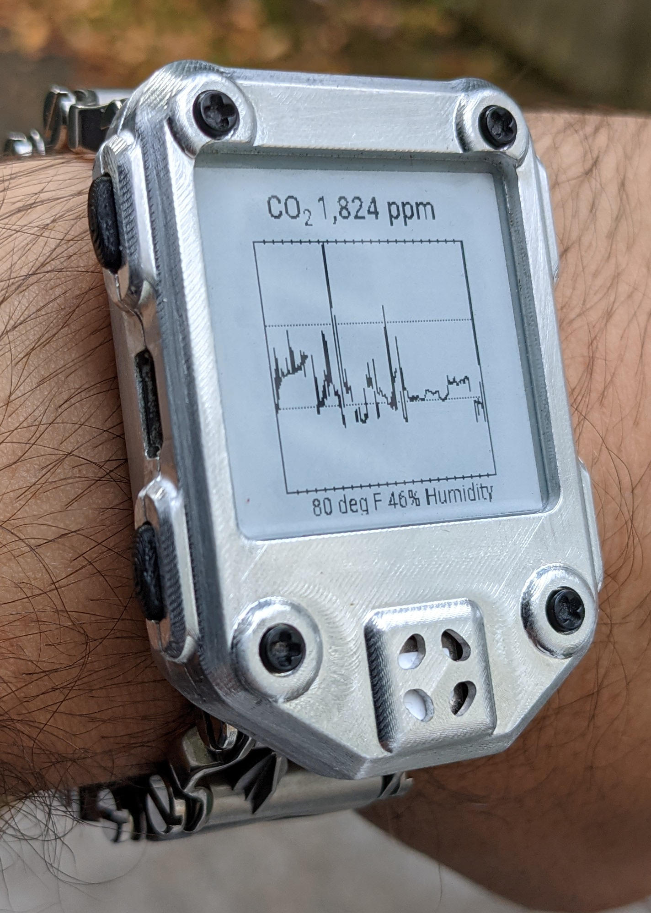
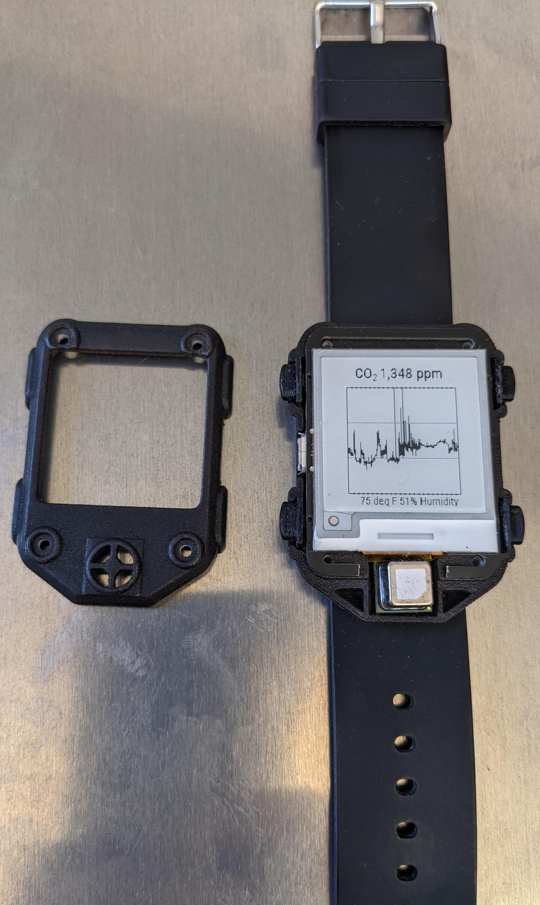

watchy-co-case
==============

A simple case modification to the
[stock Armadillonium case](https://github.com/sqfmi/watchy-cases/tree/main/Armadillonium)
in order to make space for the
[Sensirion SCD40 CO2 sensor](https://www.sensirion.com/en/environmental-sensors/carbon-dioxide-sensors/carbon-dioxide-sensor-scd4x/).

A matching PCB and installation instructions can be found at
[cscott/watchy-co2-pcb](https://github.com/cscott/watchy-co2-pcb#readme).

A watch face using the CO2 sensor can be found at
[cscott/watchy-c4](https://github.com/cscott/watchy-c4#readme).

Pictured are the case fabricated in Aluminum 6061 (CNC machining by
[pcbway.com](https://www.pcbway.com/rapid-prototyping/)) and
Nylon PA12 (SLS printed and dyed black by
[sculpteo](https://www.sculpteo.com/en/materials/sls-material/plastic-material/)).

