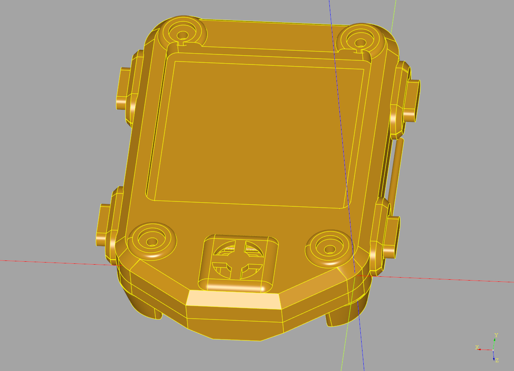

watchy-co-case
==============

A simple case modification to the
[stock Armadillonium case](https://github.com/sqfmi/watchy-cases/tree/main/Armadillonium)
in order to make space for the
[Sensirion SCD40 CO2 sensor](https://www.sensirion.com/en/environmental-sensors/carbon-dioxide-sensors/carbon-dioxide-sensor-scd4x/).

A matching PCB and installation instructions can be found at
[cscott/watchy-co2-pcb](https://github.com/cscott/watchy-co2-pcb#readme).

